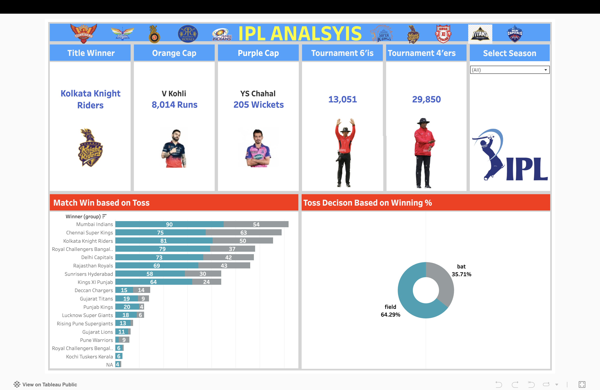

# 🏏 IPL Performance Analytics Dashboard

> **Every ball tells a story. This dashboard helps you uncover it.**

An interactive Tableau dashboard built for cricket enthusiasts to explore **17 IPL seasons (2008–2024)** through player statistics, head-to-head battles, and match-winning performances. Whether you're debating the best finisher, comparing bowlers, or analyzing player consistency, this dashboard puts the numbers at your fingertips.

---

## 📊 What's Inside?

Dive deep into **200,000+ ball-by-ball records** and explore insights from every IPL season.

### 🏆 Batting Insights
- Runs & Batting Average
- Strike Rate
- Boundary-hitting ability
- Season-wise performance

### 🎯 Bowling Insights
- Wickets
- Economy Rate
- Bowling Strike Rate
- Performance across seasons

### ⚔️ Head-to-Head Battles
Ever wondered:

- Can Bumrah consistently dismiss Kohli?
- Who dominates the Rohit vs Rashid matchup?
- Which batter has the best record against spin?

Compare **batsman vs bowler** matchups instantly.

---

## 📈 Dashboard Features

- 📅 Season-wise filtering (2008–2024)
- 🏏 Player comparison
- 🎯 Head-to-head analysis
- 📊 Interactive KPI cards
- 🔍 Dynamic filters
- 📌 Clean, single-page Tableau dashboard

---

## 📌 Key Performance Metrics

- 🏏 Batting Average
- ⚡ Strike Rate
- 🎯 Economy Rate
- 🥎 Bowling Strike Rate
- 🏆 Total Wickets
- 🤝 Head-to-Head Statistics

---

## 🌐 Live Dashboard

👉 **Explore the Dashboard**

https://public.tableau.com/views/IPL2008-2024Analysis_17710097503820/STATS

---

## 🛠️ Built With

- Tableau
- SQL
- Calculated Fields
- Interactive Filters
- KPI Cards
- Data Visualization

---

## 🎯 Why This Project?

Cricket is more than just runs and wickets. Every delivery changes the game.

This dashboard transforms raw IPL data into interactive visualizations, helping fans, analysts, and enthusiasts answer questions like:

- Who is the most consistent batter?
- Which bowler performs best in pressure situations?
- Which player dominates specific opponents?
- How have player performances evolved across IPL seasons?

---

## 📸 Dashboard Preview

---

## 👨‍💻 Author

**Parshva Panchal**

GitHub: https://github.com/parshva7

LinkedIn: https://linkedin.com/in/parshvap1
